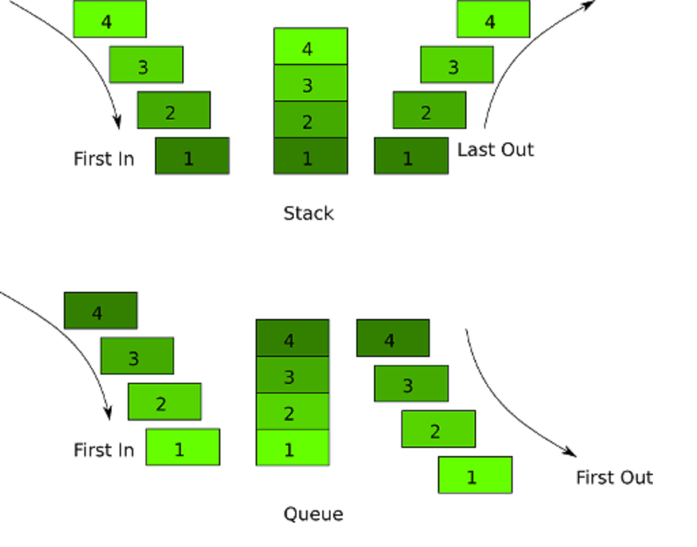

<h1>Stack</h1>

<b>A stack is a LIFO(last in first out) data structure</b>

<b>Real life stacks</b>

- A stack of dishes
- A pile of t-shirts(have you worn the bottom one in the last year?)

<b>Some practical use-cases of a stack:</b>

- The call stack - keeping track of currently active methods
- Reversing order
- Several important algorithms (like DFS)
- In editors where the word you wrote the latter is the first to evacuate when you utilize fix activity

<b>Common operations on a stack</b>

- push(elem) - adding an element to the stack
- pop() - removing an element from the stack
- peek() - "seeing" the first element, without modifing the stack
   
<h1>Queue</h1>

<b>A queue is a FIFO(first in first out) data structure</b>

<b>Some practical use-cases of a queue:</b>

- Print queues
- BFS
- Any circumstance where assets are shared among various clients and served on first start things out server premise
- Cases incorporate CPU planning, Disk Scheduling

<b>Common operations on a queue</b>

- enqueue(elem) - adding an element to the queue
- dequeue() - removing an element from the queue
- peek() - "seeing" the first element, without modifing the queue

<b>Queue vs Stack  </b>

<b>Your task is to implement a stack and a queue, using the skeleton provided.</b>

<b>The task</b>

1. Implement all methods from the Stack and Queue interfaces.
2. All tests should pass.
3. Now solve a few tasks:

[Valid Parentheses](https://leetcode.com/problems/valid-parentheses/)

[Next Greater Element](https://leetcode.com/problems/next-greater-element-i/)

[Backspace String Compare](https://leetcode.com/problems/backspace-string-compare/)

[Lemonade Change](https://leetcode.com/problems/lemonade-change/)

[Implement Queue Using Stack](https://leetcode.com/problems/implement-queue-using-stacks/description/)

[Baseball Game](https://leetcode.com/problems/baseball-game/)

[Asteroid Collision](https://leetcode.com/problems/asteroid-collision/)