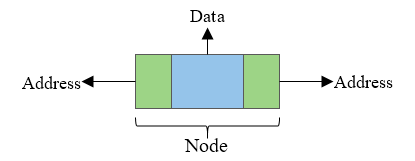
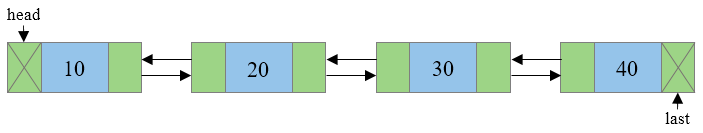

<h1>Doubly-linked List</h1>

<b>A doubly-linked list is a linear data structure, in which each node stores:</b>

- The element(value)
- A link(reference) to the next node
- A link(reference) to the previous node

<b>A doubly-linked list is used in many practical cases, where navigation in both ways is required, such as:</b>

- Web pages forward and backward navigation
- Undo and redo functionality in many applications
- In gaming, to represent various states of the game

<b>A node in a doubly-linked list:  </b>

<b>Example of doubly-linked list:  </b>

Note that the head (the first element in the list) stores a null reference. On the other hand, the tail (the last element) does not have an element after itself.

<b>Common operations on a doubly-linked list and their time complexities:</b>

- Add a new head/tail – O(1)
- Removing/retrieving the value of the head/tail – O(1)
- Adding/removing elements that are not in the beginning/end – O(n), since we do not have a direct reference and we need to traverse the whole list in the worst case
- Finding – O(n)
- Insert before/after a specific node – O(1) if we have the reference, but most often we do have to perform a search first to retrieve it

<b>Your task is to implement a doubly-linked list, using the skeleton provided.</b>

Before you begin:

- Play around in [https://visualgo.net/en/list](https://visualgo.net/en/list) (choose the DLL option from the top menu)
- Have a pen and paper draw a doubly-linked list. How would you remove or add a node in the middle? What references must be changed and in what order?

<b>The task</b>

1. Implement all methods from the DoublyLinkedList interface and the Iterator method from the Iterable interface.
2. All tests should pass.
3. Congratulations, you just implemented your first data structure!
4. Now solve a few tasks!

[Remove Duplicates from Sorted List](https://leetcode.com/problems/remove-duplicates-from-sorted-list/)

[Middle of the Linked List](https://leetcode.com/problems/middle-of-the-linked-list/description/)

[Merge Two Sorted Lists](https://leetcode.com/problems/merge-two-sorted-lists/)

[Reverse Linked Lists](https://leetcode.com/problems/reverse-linked-list/description/)

[Palindrome Linked List](https://leetcode.com/problems/palindrome-linked-list/)

[Remove Linked List Elements](https://leetcode.com/problems/remove-linked-list-elements/description/)