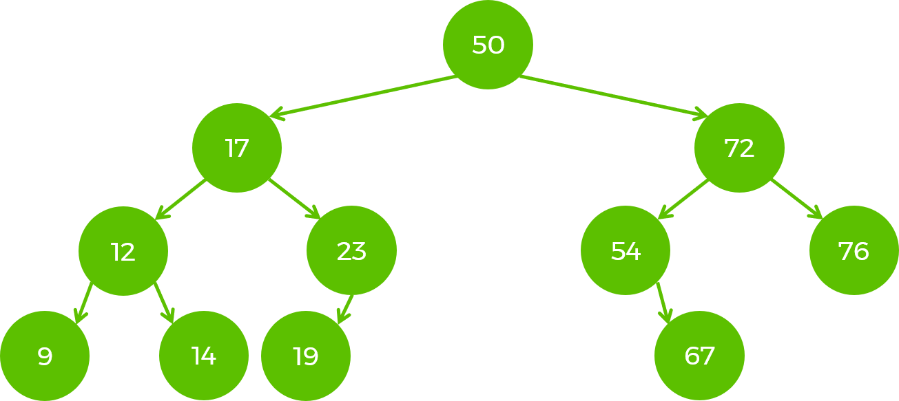

# Binary Search Tree(BST)

A binary search tree (BST), is a node-based data structure in which each node has **no more than two child nodes.** Each child must either be a leaf node or the root of another binary search tree. The left sub-tree contains only nodes with values less than the parent node; the right sub-tree contains only nodes with values greater than the parent node. 

### Some characteristics of BST:

- The root is a special node with no parents;
- A leaf is a node with no child nodes;
- It is optimized for searching, inserting and deleting which are done with O(logn);
- A tree is balanced when for each node X the difference in height of the left and the right sub-trees is <= 1

#### Some practical use-cases of BST:

- Have a sorted list of values where you can quickly add elements and still have them sorted (Consider using an array for this purpose. You have very fast access to read random values, but if you want to add a new value, you have to find the place in the array where it belongs, shift everything over, and then insert the new value);
- Maintaining a dynamically changing dataset in sorted order, for some "sortable" type;
- Implementing maps/sets in core language libraries(TreeMap/TreeSet in Java);
- In implementing more complex structures such as Binary Heap/Trie;

#### Binary search tree example:

##### Common operations on a binary search tree and their time complexities(in a balanced tree):

- Insert new node: O(logn)
- Search: O(logn)
- Remove a node: (logn)

### Your task is to implement a binary search tree, using the skeleton provided.

#### Before you begin:

- Get a better understanding of trees by playing around in [Visualgo](https://visualgo.net/en/bst);
- Draw a BST. Think about the algorithms to insert and find a node. What about deleting? How would you implement removing a node;

#### The task:

1. Implement all methods from the *BinarySearchTree* interface and the *Iterator()* method from the *Iterable* interface.
2. Implement 2 constructors.
3. All tests should pass.
4. Now solve a few tasks:

[Minimum Absolute Difference in BST](https://leetcode.com/problems/minimum-absolute-difference-in-bst/)  
[Longest Univalue Path](https://leetcode.com/problems/longest-univalue-path/description/)  
[Binary Tree Paths](https://leetcode.com/problems/binary-tree-paths/description/)  
[More](https://leetcode.com/problemset/all/?search=bst)

#### Advanced task:

- Implement remove method.