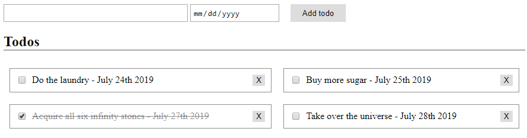

# CSS - In class task

Use CSS to make the todo app better looking.

1. Yours does not have to look exactly the same, feel free to express your creativity.

1. Display the todos in a grid of two columns.

1. Put all you CSS code in `style.css`.
