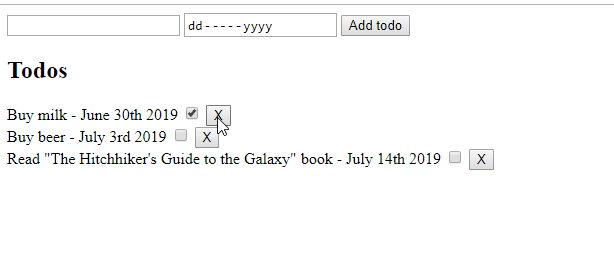

# jQuery - Tasks

We will add more features to our **ToDo app** from last time: **add, remove and mark as done/not done**.



1. Add the jQuery library using CDN. You can get the CDN code from the jQuery [site](https://code.jquery.com/).

1. А ToDo is in the format

    ```js
    {
      id: 0,
      name: 'Buy milk',
      due: new Date(2019, 05, 30),
      isDone: true
    }
    ```

1. In the `index.js` file there is already a basic structure of the JavaScript functions and variables:

   - `statics` is a object with a variable `id` that stores the current ID
   - `todos` is an array of the initial todos
   - they are loaded from the `populateTodos` function, which itslef calls `todoView`
   - Take a look at the code and get a feeling of how it works.
   - All these functions are already implemented, you have to implement:
     - `Add`
     - `Remove`
     - `Check`

1. For formating the date you could use a library called ```momentjs```. It is already imported in the template.

    ```js
    // Example
    const date = moment('2019-05-10')
    ```

1. For each todo in the array append it in the container with ```jQuery```

    - Template to use:

        ```html
        <div>
          <input data-check-id="${todo.id}" type="checkbox" ${todo.isDone ? 'checked' : ''}/>
          <span>${todo.name} - ${moment(todo.due).format('MMMM Do YYYY')}</span>
          <button data-id="${todo.id}">X</button>
        </div>
        ```

    - This uses string interpolation (`${val}`) to inject the values 
    - There are some custom attributes which allow you to delete the todo with the corresponding id when you click on them

1. Now it is time to attach the events
    - Add todo - click on ```Add``` button
    - Remove todo - click on ```X``` button
    - Mark todo done/not done - click checkbox
  
1. Use dynamic events

    - Select element by attribute [https://api.jquery.com/has-attribute-selector/](https://api.jquery.com/has-attribute-selector/)

    ```js
    // Remove
    $(document).on('click', '[data-id]', (ev) => {
      const target = $(ev.target);
      const targetID = $target.attr('data-id');

      // Filter the todos and pass them below.
      // Display an alert when a ToDo is deleted.

      populateTodos(todos, '#todos');
      
    });
    ```

1. Every time a todo is ```added/removed/checked``` you must change the todos array and use the ```populateTodos()``` function to reload them on the page.

1. Clear all the input fields once you add the todo

1. If the date is not valid ```alert``` a message.
