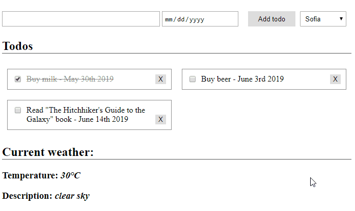

# AJAX - Tasks

You have created a **Todo app** which could **add, remove and mark them as done/not done todos**. Lets extend it by adding information about the current weather.

1. Go to [OpenWeatherMap](https://home.openweathermap.org/users/sign_up) and sign up for an account. You would need it in order to got an API Key.
1. Now log in and go to [API Keys tab](https://home.openweathermap.org/api_keys) to get your key.
2. Using Postman try to do a request to the API and study the response. We will need the `temperature` for a given city as well as the `description` of the weather.
3. In the `div` with id `main` insert a `select` element with a few cities as `option` attributes.
4. At the bottom add a new `div` resembling the one that holds the ToDo's
5. At this point you should have something like that (but not exacly the same, get creative):



7. Now add a function to `index.js` that takes the value from the `select` and make a AJAX request to the Weather API. Here is a example how that function should look like. Add you `API Key` that you got in the beggining to the URL as well as the city, chosen from the dropdown. If the function succeeds fill in the information needed from the `resposne` obect. If not `alert` that there has been an error.

    ```js

    function loadWeatherData() {
        const city = $('#city').val();

        $.ajax({
            type: "GET",
            url: /*URL + API Key*/,
            success: function (response) {
              $('#description').text(/*Description info*/)
              $('#temperature').text(/*Temperature info*/)
            },
            error: function (){
            alert('Error loading data!')
            }
        });
    }
    ```

8. Add a event listner function, just like the ones for adding/removing a ToDo that listents for `change` in the `city-select` dropdown. On change, call the `loadWeatherData()` funtion.
